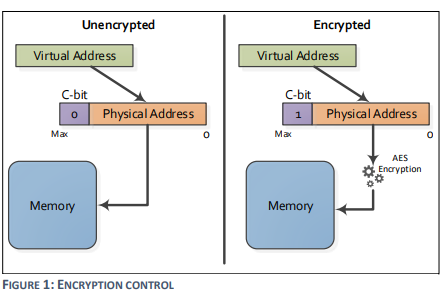

## Google Cloud Confidential Compute AMD SEV Demo

A program to be used with AMD-SEV based GCE VM (aka [Confidential VM](https://cloud.google.com/compute/confidential-vm/docs)).
This program compares the view of a private memory page with its view with C bit cleared. 
The purpose is to simulate private page's view from outside of the VM. The encrypted view. 

1. This tool gets user input string and puts it on an encrypted page (C bit set). Nothing special so far.
2. It then prints page's contents to show that VM can read it with hardware decrypting the contents because C bit is set.  
3. After that it clears the C bit for the page.
4. It prints the page's contents again, this time hardware will not decrypt. This prints encrypted view of the page. 


> This is not an officially supported Google product

This article is inspired in part by [Using AMD Secure Memory Encryption with Oracle Linux](https://blogs.oracle.com/linux/using-amd-secure-memory-encryption-with-oracle-linux)

References:
- [AMD SEV](https://developer.amd.com/sev/)



_image from [AMD_SEV Whitepaper](https://www.amd.com/system/files/TechDocs/SEV-SNP-strengthening-vm-isolation-with-integrity-protection-and-more.pdf)_


> *Only use this demo on a test VM; do NOT install on production systems!*

to restate, the kernel module demonstrates set/unset C-bit for SEV demo, this module is: 
- 1. Unsupported. Kernel does not support C bit flip on user addresses with set_memory decrypted function.
- 2. Guest swapping may not save and restore C bit, kernel does not expect user pages to have c bit diabled. 
- 3. Code below cuts corners and ignores safert checks, can lead to crash.


### Create Confidential Compute VM

```bash
gcloud compute instances create cc-1 \
  --machine-type=n2d-standard-2  --zone "us-central1-a" \
    --confidential-compute --maintenance-policy=TERMINATE
```

Verify

```bash
gcloud compute ssh cc-1

# dmesg | grep AMD | grep SEV
[    0.938565] AMD Secure Encrypted Virtualization (SEV) active
```

Install components and linux headers

```bash
sudo su -
apt-get update
apt-get install -y gcc build-essential linux-headers-$(uname -r) git

git clone https://github.com/salrashid123/gcp_cc_sev_demo.git
cd gcp_cc_sev_demo/
make
make install
```

- `sev_demo.c` is user-mode component: It allocates a page, writes some contents to it, dumps memory before and fater calling ioctl to flip C bit.
- `sevtest.c` is the kernel-mode component: It exposes an ioctl to set and clear the C bit for a user supplied address.

```bash
sudo ./sev_demo.out
```

Sample Output:

```bash
# ./sev_demo.out 

Successfully allocated an AMD SEV encrypted page, private to GCE VM.
(Memory allocated is encrypted by default, nothing special here)

Enter a secret string to write to this encrypted page:Lorem ipsum dolor sit amet, consectetur adipiscing elit

Dumping GCE VM view of the encrypted page...
(Read access will get decrypted page contents from hardware)

0x5637cca20000: 4C 6F 72 65 6D 20 69 70 73 75 6D 20 64 6F 6C 6F 	Lorem ipsum dolo
0x5637cca20000: 72 20 73 69 74 20 61 6D 65 74 2C 20 63 6F 6E 73 	r sit amet, cons
0x5637cca20000: 65 63 74 65 74 75 72 20 61 64 69 70 69 73 63 69 	ectetur adipisci
0x5637cca20000: 6E 67 20 65 6C 69 74 0A 00 00 00 00 00 00 00 00 	ng elit.........
0x5637cca20000: 00 00 00 00 00 00 00 00 00 00 00 00 00 00 00 00 	................
0x5637cca20000: 00 00 00 00 00 00 00 00 00 00 00 00 00 00 00 00 	................
0x5637cca20000: 00 00 00 00 00 00 00 00 00 00 00 00 00 00 00 00 	................
0x5637cca20000: 00 00 00 00 00 00 00 00 00 00 00 00 00 00 00 00 	................
0x5637cca20000: 00 00 00 00 00 00 00 00 00 00 00 00 00 00 00 00 	................
0x5637cca20000: 00 00 00 00 00 00 00 00 00 00 00 00 00 00 00 00 	................
0x5637cca20000: 00 00 00 00 00 00 00 00 00 00 00 00 00 00 00 00 	................
0x5637cca20000: 00 00 00 00 00 00 00 00 00 00 00 00 00 00 00 00 	................
0x5637cca20000: 00 00 00 00 00 00 00 00 00 00 00 00 00 00 00 00 	................
0x5637cca20000: 00 00 00 00 00 00 00 00 00 00 00 00 00 00 00 00 	................
0x5637cca20000: 00 00 00 00 00 00 00 00 00 00 00 00 00 00 00 00 	................
0x5637cca20000: 00 00 00 00 00 00 00 00 00 00 00 00 00 00 00    	...............

Turning encryption off on the page to simulate host view of the page.
Dumping the page again...
(Hardware will not decrypt reads this time because page is not marked encrypted anymore)

0x5637cca20000: 8A 2C 81 80 BC 95 6C 5A 72 1C 37 DB 79 FC 2E FD 	�,����lZr.7�y�.�
0x5637cca20000: 07 5A 3C 9A 46 E1 FB 42 7C 2A 10 C6 B7 04 31 BE 	.Z<�F��B|*.Ʒ.1�
0x5637cca20000: F1 93 51 26 DF 58 08 CE 47 ED E1 4F BA 5F B9 6E 	�Q&�X.�G��O�_�n
0x5637cca20000: 99 15 7C CA E8 24 E3 13 55 4C 0F DC C5 7A 04 22 	�.|��$�.UL.��z."
0x5637cca20000: 20 FC 96 4E 6B EC D3 40 D5 88 7E AF 3A C9 B4 7C 	 ��Nk��@Ո~�:ɴ|
0x5637cca20000: 94 9F A8 45 95 AE DC F2 3F 52 0B AF 07 B1 61 09 	���E����?R.�.�a.
0x5637cca20000: 64 16 CC A4 01 09 7E 47 B4 C3 55 82 1D 19 43 F6 	d.̤..~G��U�..C�
0x5637cca20000: 3B 37 9A E8 CC 3D 99 01 15 CE B3 5E FE 85 56 C9 	;7���=�..γ^��V�
0x5637cca20000: 20 60 99 85 C8 BE AC 53 42 33 02 17 F0 9D 4E ED 	 `��Ⱦ�SB3..�N�
0x5637cca20000: D8 99 7C E0 C1 48 5F 5B CF D9 21 83 52 A1 56 B3 	|��H_[��!�R�V�
0x5637cca20000: DB 6D 6A 56 ED A1 DF A8 7A 0F 1F BD 05 73 9A 50 	�mjV��ߨz..�.s�P
0x5637cca20000: 39 FD 84 00 C9 8D 8B DD 8B BD 29 71 5D 1A 38 C4 	9��.ɍ�݋�)q].8�
0x5637cca20000: CE 12 3E A8 E1 31 0E A6 31 4B F3 CA 89 B3 72 BA 	�.>��1.�1K�ʉ�r�
0x5637cca20000: BF 30 27 34 2F 9F 19 51 02 27 F9 A0 23 13 09 5D 	�0'4/�.Q.'��#..]
0x5637cca20000: 28 CD AC 31 6B 50 7C CB 1E EC D4 9B 1D 66 45 3D 	(ͬ1kP|�.�ԛ.fE=
0x5637cca20000: 4A E6 20 42 25 98 C5 84 B2 D1 C1 DC 97 EE CA    	J� B%�ń���ܗ��
```

Alternatively, you can use golang for this demo:

```bash
go get golang.org/x/sys/unix

go run main.go 
Enter text: Lorem ipsum dolor sit amet, consectetur adipiscing elit
c-bit set to default(1):  0xc0000842c0  Value :  Lorem ipsum dolor sit amet, consectetur adipiscing elit

------------------------------
c-bit set to 0; Address:  0xc0000842c0  Value :  7��-b�#��F=)�{���&1r�,�;�_0b8��[50K��p�,Ǥh�}�*$/
------------------------------
c-bit set to 1; Address:  0xc0000842c0  Value :  Lorem ipsum dolor sit amet, consectetur adipiscing elit
```

---

